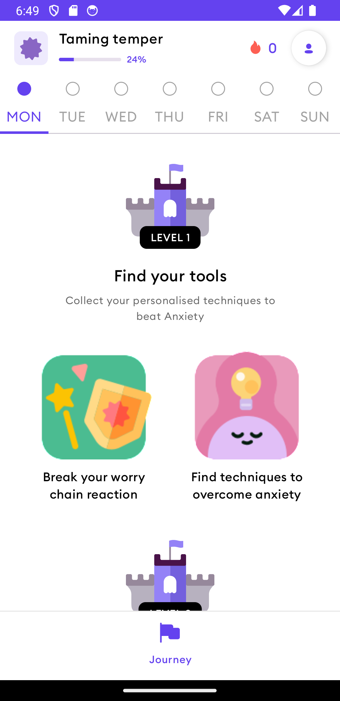

# 😡➡️😃 Temper Tamer

# Installation
1. Open in Android Studio
2. Run the app
3. Enjoy!

# Libraries
I chose these libraries because they are the most modern and recommended by Google. They are also
easy to use and have good documentation.
- Jetpack compose for UI - faster development, less boilerplate
- MVVM - separation of concerns
- Hilt - dependency injection
- Room - local database for persistence
- Kotlinx Serialization - serialization/deserialization of JSON

# Architecture
I chose MVVM together with DDD (Domain Driven Design)  and CLEAN architecture. This way the code is
more organized and easier to maintain.
But, i didn't create DTO's because the models are simple, i didn't see the need for them, and i
wanted to reduce redundancy in the code.
The app is divided into 3 layers:
- Domain (domain package) - contains the use cases and models
  - Entity - models that represent data for the local database
  - Enumeration - enumerations used by models to reperesent fixed value sets
  - Model - models that represent data that are not saved to the local database
  - Response - models that represent data from the API
- Data (data package) - contains the repository and data sources
  - Cache - logic for saving and retrieving data to local cache (for this use case, internal files)
  - Converter - logic for converting objects from one type to another
  - Dao - data access objects for the local database
  - DB - Implementation of the local database
  - Downloader - logic for downloading data from a url
  - Repository - logic for retrieving data from the local cache or the API
  - Service - logic for retrieving data from repositories
  - UseCase - logic for retrieving data from a service without knowing the source
- Presentation (ui package) - contains the view models and UI
  - Activity - Activities for the app (for this case, only main activity because we are using 
    Jetpack compose)
  - Component - Reusable composable components
  - NavGraph - Navigation graphs for the app
  - Screen - Screens representing a new navigation destination
  - Theme - Theme, color, and typography
  - ViewModel - View models for the app

# Challenges
- Rendering PDF as Images for icons
  - Solution: Used PDFRenderer to get a bitmap, then converted the bitmap to an ImageBitmap to 
    be used in Jetpack Compose
- Showing the activities in the manner shown in figma
  - Solution: At first, i used FlowColumn and i couldn't get to center a row where there is only 
    1 item. So, i read the documentation and found out that i should be using FlowRow instead.

# Future iterations
- Create DTO's to not expose the models from the domain layer
- Add more screens
- Add more tests
- Add more animations
